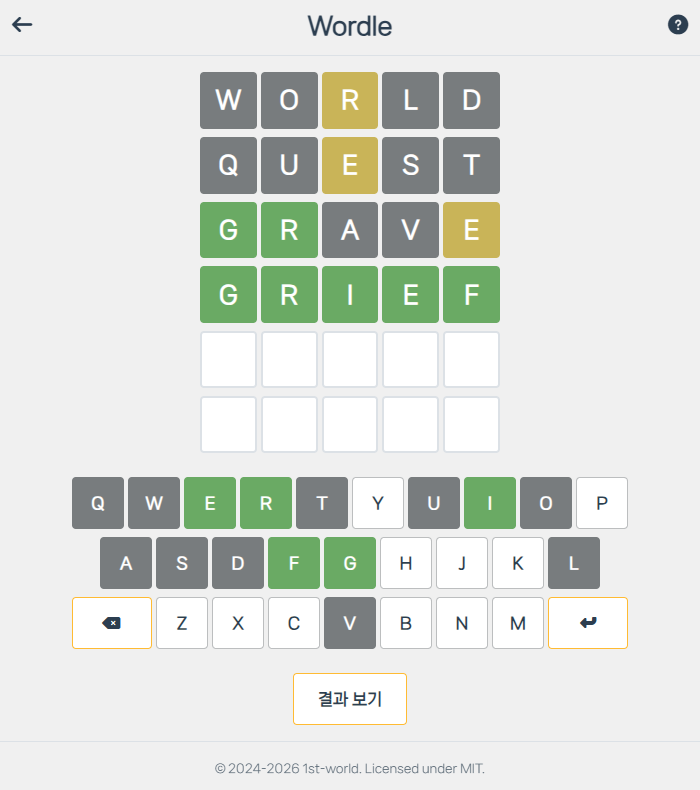

# English Games

이 프로젝트는 영어 관련 미니 게임을 제공하는 웹 서비스입니다. 메인 로비에서 게임을 선택할 수 있으며, 현재는 **Wordle**이 구현되어 있고 추후 더 많은 게임이 추가될 예정입니다. 개발 로드맵은 [Wiki Pages](https://github.com/1st-world/English-Games/wiki)의 문서를 참고해 주세요.

## Wordle 개요

**Wordle**은 주어진 6번의 기회 안에 특정 글자 수의 단어를 추측하는 게임입니다. 각 추측에 대해 단어의 위치와 정확성을 색상으로 피드백하며, 라운드가 종료되면 정답 단어와 함께 그 사전적 의미를 제공하여 교육적 효과를 더했습니다.

### 규칙

- 무작위로 선택된 영단어를 6번의 기회 안에 추측해야 합니다.

- 추측한 단어의 정확성을 글자마다 색상으로 표시:
  - **녹색**: 글자와 위치가 모두 정확합니다.
  - **황색**: 단어에 포함되지만 위치가 다른 글자입니다.
  - **회색**: 단어에 포함되지 않는 글자입니다.

    

### 데이터 소스 및 API

- **유효 단어 목록**: `words_alpha_sorted.txt`
  - 사용자가 입력한 단어가 실제 유효한 단어인지 검증하는 데 사용합니다.
  - 도전장(Challenge) 공유 링크로 전달된 단어의 유효성 검사에도 활용합니다.

- **정답 후보 및 난이도 데이터**: `word_frequencies.json`
  - 게임 시작 시 정답 단어를 이 로컬 데이터에서 선택합니다.
  - 단어가 현실에서 사용되는 빈도 정보를 바탕으로 난이도를 구분합니다.
  - 해당 글자 수 또는 난이도에 맞는 후보가 없을 경우, 가능한 전체 후보군에서 무작위로 선택합니다.

- **단어 의미 검색**: [Free Dictionary API](https://dictionaryapi.dev/)
  - 게임 종료 후 정답 단어의 뜻을 제공하기 위해 사용합니다.
  - 네트워크 문제 및 API 응답 실패 등으로 이 기능이 동작하지 않아도 게임 자체는 진행 가능합니다.

- **로컬 단어 데이터 출처**
  - `words_alpha_sorted.txt`는 [dwyl / English-words](https://github.com/dwyl/english-words) 저장소에서 가져온 내용을 토대로 합니다.
  - `word_frequencies.json`은 `words_alpha_sorted.txt`의 내용을 바탕으로 `wordfreq`의 `zipf_frequency`를 활용해 제작했습니다.

## 실행 방법

이 프로젝트는 로컬 서버 또는 GitHub Pages를 통해 웹 브라우저에서 바로 실행할 수 있습니다.
   
- [**GitHub Pages에서 바로 플레이하기**](https://1st-world.github.io/English-Games/)

- **로컬에서 실행하기**
    1. 이 저장소를 클론하거나 다운로드합니다.
    2. 프로젝트 경로 내 모든 파일이 누락 없이 존재하는지 확인합니다.
    3. 브라우저 보안 정책(CORS)으로 인해, 단순 파일 열기 대신 로컬 웹 서버를 통해 실행해야 합니다.
        - VS Code의 'Live Server' 확장 프로그램 사용 권장
        - 또는 Python이 설치된 경우: `python -m http.server 8000`

## 라이선스(License)

- 본 프로젝트의 코드는 기본적으로 [MIT License](LICENSE)를 따릅니다.

- 사용자 웹 브라우저의 '엄격한 추적 방지' 모드 등에서 외부 CDN을 차단하면 시스템 기본 글꼴이 적용되는 현상을 해결하기 위해, 글꼴 파일을 프로젝트 내에 직접 포함하여 로드하고 있습니다. 글꼴의 라이선스는 코드와는 별개이며, 해당하는 정책을 준수해야 합니다.
    - 적용 글꼴: **나눔스퀘어 네오(NanumSquareNeo)**
    - 네이버 나눔글꼴의 지적 재산권은 네이버와 네이버 문화재단에 있습니다. 네이버 나눔글꼴은 개인 및 기업 사용자를 포함한 모든 사용자에게 무료로 제공되며 글꼴 자체를 유료로 판매하는 것을 제외한 상업적인 사용이 가능합니다.
